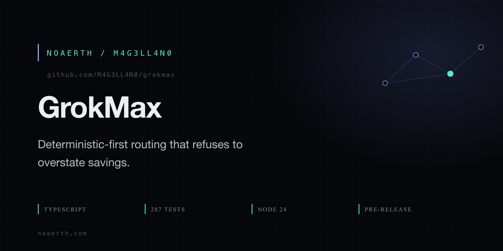

# GrokMax

<p align="center">
  <picture>
    <source media="(prefers-reduced-motion: reduce)" srcset="assets/hero/hero-reduced.svg">
    <source media="(prefers-color-scheme: light)" srcset="assets/hero/hero-light.svg">
    
  </picture>
</p>

<p align="center">
  <picture>
    <source media="(prefers-reduced-motion: reduce)" srcset="assets/hero/computational-dark.svg">
    <source media="(prefers-color-scheme: light)" srcset="assets/hero/computational-light.svg">
    
  </picture>
</p>

<p align="center">
  
</p>

**Minimize GrokBot usage while maximizing verified useful output.**

GrokMax is a deterministic-first execution pipeline for GrokBot: it routes every
task to the cheapest capable executor, slims the context to what matters, and
caches the result across five layers so nothing is paid for twice.

```text
TASK -> normalize -> fingerprint -> L0/L1 exact -> L2 normalized -> L3 semantic
     -> L4 artifact -> L5 knowledge -> slice context -> compile micro-prompt
     -> route -> execute -> compress -> save cache/artifact -> ledger
```

Route priority (mission order):

```text
deterministic > api          > chatgpt        > opencode        > grokbot
zero-cost     > direct tool  > research/cheap > repo work       > persistent/authed
```

> ## Release status — read this first
>
> `v0.2.0-rc.2` is a **pre-release, and this project's own adversarial audit
> marks it NOT READY.** That audit is committed at
> [`docs/GROKBOT-VERIFICATION.md`](docs/GROKBOT-VERIFICATION.md), including a
> historical CRITICAL finding that was real and a gate that failed 21/22.
>
> What is safe to rely on: the deterministic routing pipeline, the five-layer
> cache, the ledger, and the `doctor` command.
>
> What is **not** cleared: live account-savings claims, Edge Mode, and any
> absolute-cost marketing. Numbers from the pipeline are labelled `measured`,
> `estimated` or `proxy`, and a proxy is not a bill.

## Why

GrokBot is the most capable executor — and the most expensive one. Most tasks on
any given day are not GrokBot-only tasks. They are:

- math (`Calculate 7*8`), hashing (`sha256 of …`), file counts, `git status`
- cached answers to questions asked yesterday
- repository edits that any capable coding agent can do more cheaply
- lookups a direct API does in milliseconds

GrokMax catches those *before* they become GrokBot invocations.

## Key properties

| Property | What it means |
| --- | --- |
| Deterministic-first | Zero-cost local executors handle math/hash/count/git before anything costs money. |
| 5-layer cache | L1 exact, L2 normalized, L3 semantic, L4 artifact, L5 durable knowledge. |
| Context slicing | Sends ~1,500 relevant tokens instead of 20,000. Reductions are a **proxy** for token cost, never a billed measurement. |
| Constraint preservation | Hard constraints survive verbatim into the final prompt; `validatePreservation` flags any loss. |
| Budget ceilings | `maxCostUsd` and `maxGrokBotUsage` are hard ceilings. Over-budget GrokBot routes refuse rather than pretend. |
| Honest telemetry | Every number is labeled **measured / estimated / proxy** in the ledger. Savings are proxies unless imported from live measurement. |
| Graceful degradation | No provider, no problem — routing returns `none` and the pipeline reports it plainly. |

## Quick start

Requirements: Node **>= 24** (uses `node:sqlite`), `pnpm` 8+.

```sh
git clone https://github.com/M4G3LL4N0/grokmax.git
cd grokmax
pnpm install
pnpm cli doctor          # health check across every subsystem
pnpm cli benchmark       # measured on THIS machine; deterministic-only, no spend
```

```sh
pnpm cli optimize "Calculate 7*8 and return the integer result"
# ROUTE  DETERMINISTIC
# ...    7*8 = 56   (zero cost, cached for the next identical ask)

pnpm cli route "Refactor the scheduler module and add tests"
# ROUTE  OPENCODE
# GROKBOT not required

pnpm cli dry-run "Fix the typecheck error in src/main.ts"
# ROUTE  OPENCODE   -> SKIPPED  (plan only; nothing executed)

pnpm cli savings
# honest report across your ledger runs (proxy unless measured)
```

## CLI reference

| Command | Description |
| --- | --- |
| `grokmax optimize "<goal>"` | Full pipeline: plan + outcome. |
| `grokmax run <intent> <goal>` | Explicit intent + goal. |
| `grokmax ask "<question>"` | Shorthand: intent = goal = question. |
| `grokmax edge "<task>"` | Edge Mode: complete the work before GrokBot. See [docs/EDGE-MODE.md](docs/EDGE-MODE.md). |
| `grokmax preflight "<task>"` | In-Bot preflight contract for the GrokBot skill. See [docs/INBOT-MODE.md](docs/INBOT-MODE.md). |
| `grokmax route "<goal>"` | Routing decision only (never executes). |
| `grokmax dry-run "<goal>"` | Plan without executing anything. |
| `grokmax explain <runId>` | Inspect a specific run in the ledger. |
| `grokmax cache stats\|prune\|clear` | Cache health / maintenance. |
| `grokmax usage` | Ledger summary, honestly labeled. |
| `grokmax usage snapshot add\|list\|diff` | Provenance-aware platform usage observations. See [docs/PLATFORM-MEASUREMENT.md](docs/PLATFORM-MEASUREMENT.md). |
| `grokmax experiment create\|record\|report` | Reproducible live experiment sessions. See [docs/LIVE-BENCHMARK.md](docs/LIVE-BENCHMARK.md). |
| `grokmax bench manifest\|compare\|assert-cold\|reset-fixture` | Benchmark manifests and contamination guards. |
| `grokmax savings` | Savings report (`--json` for machine-readable). |
| `grokmax benchmark` | Run fixture suites, measured locally. |
| `grokmax doctor` | Health checks across every subsystem. |
| `grokmax status` | One-view aggregate (doctor + cache + ledger + savings). |

Add `--json` to any command for machine-readable output. By default the
database lives at `data/grokmax.db`; override with `GROKMAX_DB`.

## Repo layout

```text
app/
  cli/              commander-based CLI (optimize/run/ask/route/dry-run/benchmark/doctor/…)
packages/
  core/             engine, types, normalize, fingerprint, pipeline
  cache/            SQLite-backed L0–L5 cache fabric
  adapters/         provider adapters (deterministic/opencode/chatgpt/grokbot/api)
  context/          context slicer
  compiler/         micro-prompt compiler + constraint preservation
  router/           deterministic-first router + cost model
  ledger/           usage ledger with honest measurement labels
  artifacts/        L4 artifact store + L5 knowledge store
  providers/        provider contracts + registry
  telemetry/        honest savings computation
  doctor/           subsystem health checks
benchmarks/
  suites/           5 fixture categories, 33 tasks (math / repo / hash / files / escape)
skills/
  grokmax/SKILL.md  the reusable GrokBot skill
```

## Honesty policy

This project’s integrity is its product. Savings numbers are:

- **measured** – only when manually imported from live usage observation.
- **estimated** – cost/token estimates marked as such everywhere.
- **proxy** – router-level avoided-GrokBot counts and context reductions.
  Useful, directional, and never presented as platform-anonymous measurements.

## Roadmap

- [x] Monorepo + 11 subsystem packages
- [x] CLI, doctor, benchmark, honest telemetry
- [x] Reusable GrokBot skill
- [ ] REPL / daemon mode
- [ ] Live GrokBot usage import (manual measured bridge)

## License

MIT. See [LICENSE](LICENSE).

<!-- TRILLIONX:presentation:begin -->

### Animated surfaces

Generated from this repository's own source tree: every count, route and module below was measured, not written by hand.

#### Identity

<picture>
  <source media="(prefers-reduced-motion: reduce)" srcset="https://raw.githubusercontent.com/M4G3LL4N0/grokmax/main/.github-art/surfaces/hero-reduced.svg">
  <source media="(prefers-color-scheme: light)" srcset="https://raw.githubusercontent.com/M4G3LL4N0/grokmax/main/.github-art/surfaces/hero-light.svg">
  
</picture>

#### Entry points

<picture>
  <source media="(prefers-reduced-motion: reduce)" srcset="https://raw.githubusercontent.com/M4G3LL4N0/grokmax/main/.github-art/surfaces/terminal-reduced.svg">
  <source media="(prefers-color-scheme: light)" srcset="https://raw.githubusercontent.com/M4G3LL4N0/grokmax/main/.github-art/surfaces/terminal-light.svg">
  
</picture>

#### Modules

<picture>
  <source media="(prefers-reduced-motion: reduce)" srcset="https://raw.githubusercontent.com/M4G3LL4N0/grokmax/main/.github-art/surfaces/architecture-reduced.svg">
  <source media="(prefers-color-scheme: light)" srcset="https://raw.githubusercontent.com/M4G3LL4N0/grokmax/main/.github-art/surfaces/architecture-light.svg">
  
</picture>

#### Primitives

<picture>
  <source media="(prefers-reduced-motion: reduce)" srcset="https://raw.githubusercontent.com/M4G3LL4N0/grokmax/main/.github-art/surfaces/state_machine-reduced.svg">
  <source media="(prefers-color-scheme: light)" srcset="https://raw.githubusercontent.com/M4G3LL4N0/grokmax/main/.github-art/surfaces/state_machine-light.svg">
  
</picture>

#### Composition

<picture>
  <source media="(prefers-reduced-motion: reduce)" srcset="https://raw.githubusercontent.com/M4G3LL4N0/grokmax/main/.github-art/surfaces/component_map-reduced.svg">
  <source media="(prefers-color-scheme: light)" srcset="https://raw.githubusercontent.com/M4G3LL4N0/grokmax/main/.github-art/surfaces/component_map-light.svg">
  
</picture>

#### Build and tests

<picture>
  <source media="(prefers-reduced-motion: reduce)" srcset="https://raw.githubusercontent.com/M4G3LL4N0/grokmax/main/.github-art/surfaces/build-reduced.svg">
  <source media="(prefers-color-scheme: light)" srcset="https://raw.githubusercontent.com/M4G3LL4N0/grokmax/main/.github-art/surfaces/build-light.svg">
  
</picture>

#### Workflow

<picture>
  <source media="(prefers-reduced-motion: reduce)" srcset="https://raw.githubusercontent.com/M4G3LL4N0/grokmax/main/.github-art/surfaces/workflow-reduced.svg">
  <source media="(prefers-color-scheme: light)" srcset="https://raw.githubusercontent.com/M4G3LL4N0/grokmax/main/.github-art/surfaces/workflow-light.svg">
  
</picture>

#### Domain

<picture>
  <source media="(prefers-reduced-motion: reduce)" srcset="https://raw.githubusercontent.com/M4G3LL4N0/grokmax/main/.github-art/surfaces/domain-reduced.svg">
  <source media="(prefers-color-scheme: light)" srcset="https://raw.githubusercontent.com/M4G3LL4N0/grokmax/main/.github-art/surfaces/domain-light.svg">
  
</picture>

#### Identity object

<picture>
  <source media="(prefers-reduced-motion: reduce)" srcset="https://raw.githubusercontent.com/M4G3LL4N0/grokmax/main/.github-art/surfaces/footer-reduced.svg">
  <source media="(prefers-color-scheme: light)" srcset="https://raw.githubusercontent.com/M4G3LL4N0/grokmax/main/.github-art/surfaces/footer-light.svg">
  
</picture>

<!-- TRILLIONX:presentation:end -->

<!-- TRILLIONX:evidence:begin -->

## What is measurable here

Generated by `.github-art` from the source tree at publish time.

| Signal | Value |
| --- | --- |
| HTTP routes | 0 |
| Entry points | 16 |
| Module roots | 16 |
| Test files | 26 |
| CI workflows | 1 |
| Distinctive stack | scaffold only |
| Status | LIVE |
| Evidence confidence | E3 |
| Animated surfaces | 9 |

<!-- TRILLIONX:evidence:end -->
